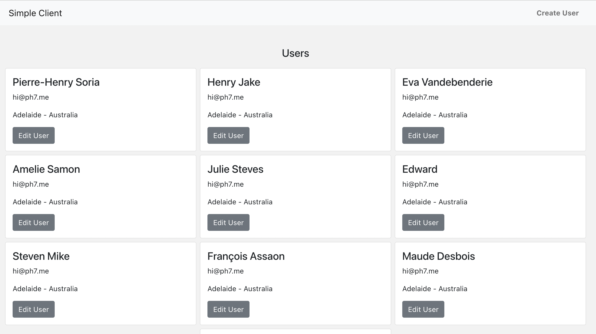

# ProjectU - React Client

A simple and elegant client built for my Udemy course available at: https://www.udemy.com/course/build-backend-api-node-js-and-react-frontend/

The client uses Bootstrap v5 (with React-Bootstrap components), React-Router v6, React Content Loader, and Styled Components.

## Setting Up

1. Make sure you have npm v6 or newer installed (by installing [NodeJS](https://nodejs.org/en/download)).
2. Run `npm ci` to install all dependencies.
3. `npm start` to start your React client application.

## Preview

## License

Distributed under [MIT](https://opensource.org/licenses/MIT) license 🎉
